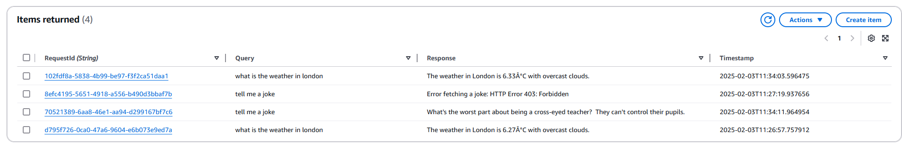

# Chatbot Project

This chatbot is deployed on AWS with the following architecture:

- **API Gateway**: Exposes an endpoint (`POST /chatbot`)
- **Lambda (Python 3.9)**: Core logic to handle requests
- **DynamoDB**: Stores logs (query, response, timestamp)
- **S3**: Stores documentation or any static files
- **CloudFormation**: Automates the creation of all AWS resources

## Deployment Steps

1.  **Install AWS CLI** and configure with your credentials.
    - Create an IAM user with programmatic access (get the **Access key** and **Secret Access Key**)
    - then type
    ```bash
     aws configure
    ```
    - Enter the credentials from IAM user
      - AWS Access Key ID
      - AWS Secret Access Key
      - Default region name (e.g., us-east-1)
      - Default output format (e.g., json)
2.  **Obtain OpenWeatherMap API key** from [openweathermap.org](https://openweathermap.org/).
    - Need to singup and enter credit card for free api. After sign up grab the API key
3.  **Cloudformation deployment** Validate and create the stack:

    ```bash
    aws cloudformation validate-template --template-body file://template.yaml

    aws cloudformation create-stack \
        --stack-name ChatbotStack \
        --template-body file://template.yaml \
        --capabilities CAPABILITY_NAMED_IAM \
        --parameters ParameterKey=OpenWeatherApiKey,ParameterValue=YOUR_OPENWEATHER_API_KEY  <=== put the API key from openweathermap
    ```

4.  **Wait for the stack creation**

    ```bash
    aws cloudformation wait stack-create-complete --stack-name ChatbotStack
    ```

5.  **Confirm the completion of the stack**

    ```bash
    aws cloudformation describe-stacks --stack-name ChatbotStack
    ```

    > Check for StackStatus: CREATE_COMPLETE

## Testing APIs

1. Weather API ([OpeanWeatherMap](https://openweathermap.org/api/one-call-3))

   ```bash
   $ curl -X POST   -H "Content-Type: application/json"   -d '{"query":"What is the weather in London"}'   https://y0za5y4xy7.execute-api.us-east-1.amazonaws.com/prod/chatbot                                % Total    % Received % Xferd  Average Speed   Time    Time     Time  Current
                                   Dload  Upload   Total   Spent    Left  Speed
   100   264  100   223  100    41    163     30  0:00:01  0:00:01 --:--:--   193{"statusCode": 200, "body": "{\"requestId\": \"d795f726-0ca0-47a6-9604-e6b073e9ed7a\", \"response\": \"The weather in London is 6.27\\u00c2\\u00b0C with overcast clouds.\"}", "headers": {"Content-Type": "application/json"}}
   ```

2. Joke API ([icanhazdadjoke.com](https://icanhazdadjoke.com/api))

   ```bash
   $ curl -X POST   -H "Content-Type: application/json"   -d '{"query":"Tell me a joke"}'  https://y0za5y4xy7.execute-api.us-east-1.amazonaws.com/prod/chatbot                                                % Total    % Received % Xferd  Average Speed   Time    Time     Time  Current
                                Dload  Upload   Total   Spent    Left  Speed

    100 282 100 256 100 26 196 19 0:00:01 0:00:01 --:--:-- 216{"statusCode": 200, "body": "{\"requestId\": \"70521389-6aa8-46e1-aa94-d299167bf7c6\", \"response\": \"What's the worst part about being a cross-eyed teacher?\\r\\n\\r\\nThey can't control their pupils.\"}", "headers": {"Content-Type": "application/json"}}

   ```

## DynamoDB logs



### High-Level Architecture Notes

A brief overview of how everything fits together:

1. **API Gateway** handles incoming requests at the `/chatbot` endpoint (POST). When someone sends a JSON payload (e.g., `{"query":"Tell me a joke"}`), API Gateway passes that request data to the Lambda function.

2. **Lambda Function**

   - looks at the `query` field in the request body.
   - If the query is about “weather,” the function calls the OpenWeatherMap API to get current weather data.
   - If the query asks for a “joke,” it contacts the icanhazdadjoke.com endpoint to fetch a random joke.
   - The Lambda function then logs both the user’s query and the returned response (including a timestamp) in **DynamoDB**.

3. **DynamoDB** serves as the log storage. Each request is recorded with:

   - A unique `RequestId` (UUID)
   - The `Query` text
   - The `Response` text (weather details or joke)
   - A `Timestamp` in UTC

4. **S3 Bucket** is also included to store documentation or static files (e.g., README or images). It’s not required to handle the actual chat logic but can be useful for project assets.

   Example of private upload to s3

   ```bash
   aws s3 cp README.md s3://chatbot-docs-bucket-123456/
   aws s3 cp image.png s3://chatbot-docs-bucket-123456/
   upload: .\README.md to s3://chatbot-docs-bucket-123456/README.md
   upload: .\image.png to s3://chatbot-docs-bucket-123456/image.png

   ```
